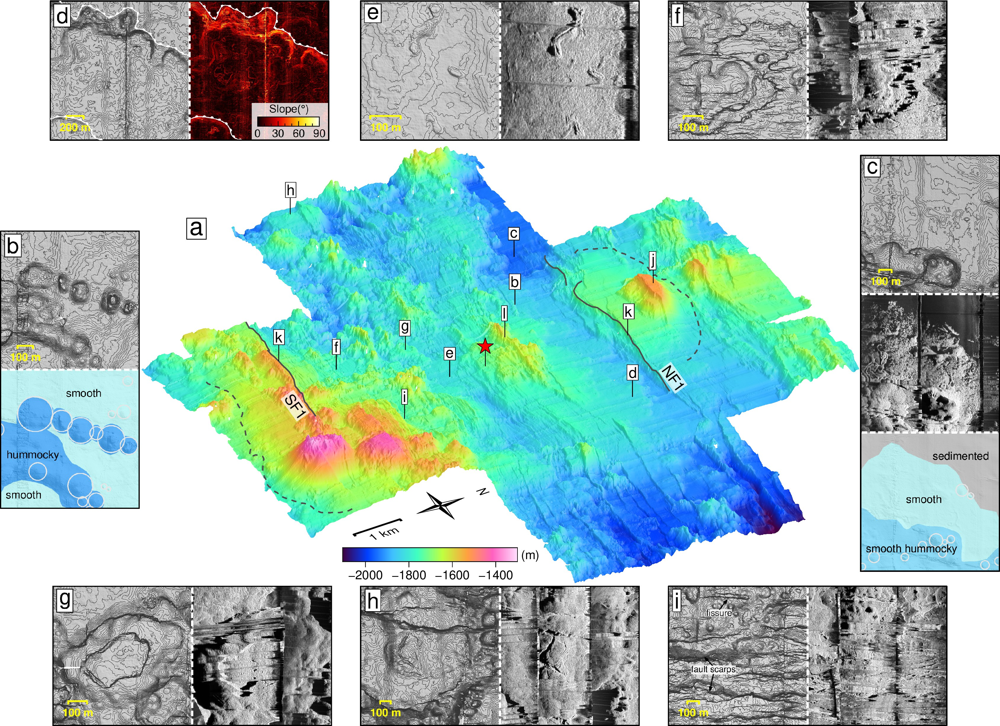
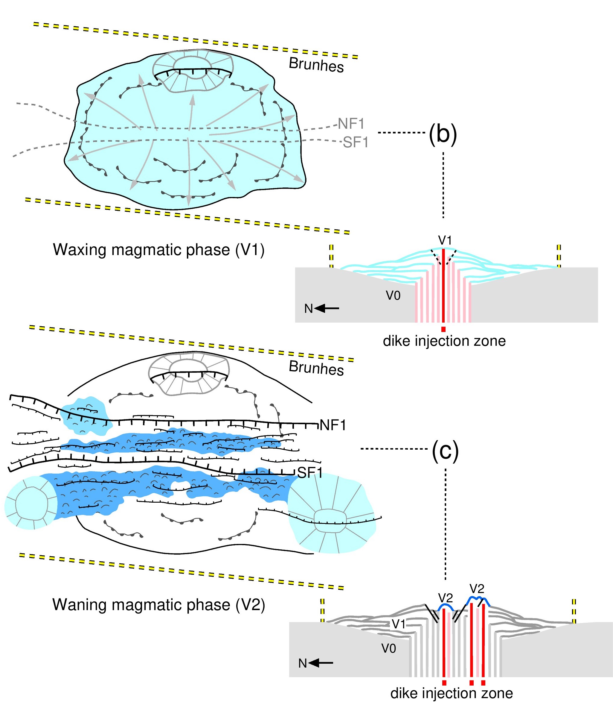
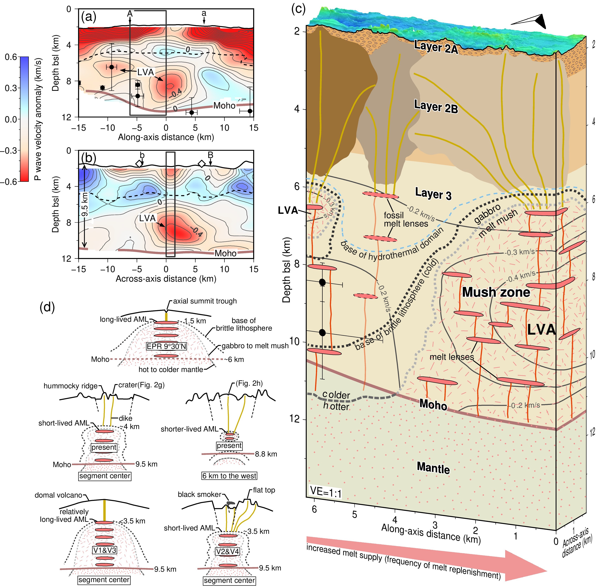

Melt supply at the ultraslow-spreading Southwest Indian Ridge (SWIR) has been shown to vary from nearly-amagmatic, leading to ultramafic seafloor, to magmatically-robust, producing fully volcanic seafloor. The center of the SWIR 50°28'E segment represents a magmatically-robust endmember.  AUV-based, 2-m resolution bathymetry and backscatter data are used to map seafloor morphologies and fault distribution, and seafloor photographs are used to map lava morphologies at the SWIR 50°28'E over the past 780 kyr. The results show evidence of high eruption rates and low tectonic strain, close to what has been observed at intermediate- and fast-spreading ridges. Mapping shows that the modes of upper-crustal construction have varied both in space and time, likely in response to changes in melt supply. Particularly, we propose that the upper crust at this magmatically-robust ridge section was constructed with alternating waxing and waning phases of melt supply over cycles of ~300 kyr. 

Download  PDF

断桥区位于SWIR第27洋脊段中心（SWIR 50°28′E），其地壳厚度达9.5 km且在下地壳4-9 km深度范围内存在地震低速异常的岩浆房。论文研究的数据来自2016年“潜龙二号”自主水下机器人采集的高分辨率多波束测深和侧扫和近底磁异常以及2015年拖曳采集的海底摄像。论文对断桥区780千年内的海底火山地形、断层构造以及熔岩流形态进行地质填图和描写。结果显示断桥区岩浆喷发速度较快且构造应变较低，其观测值可与中速和快速扩张的洋中脊相当。此外，研究发现断桥区的上地壳具有‘光滑圆顶火山-丘状火山脊‘旋回构造的特点，其周期约为300千年，可能归因于交替的岩浆增强期和岩浆减弱期。在岩浆增强期，岩浆供给频率高，导致下地壳岩浆供给系统上升变浅。岩墙侵入此时较为集中，岩浆喷发速度较快，形成光滑的圆顶火山。在岩浆减弱期，岩浆供给频率较低，导致下地壳岩浆供给系统下沉。此时，岩墙侵入较为集散，岩浆喷发速度也较慢，多形成丘状火山脊。脆性的岩石圈在岩浆减弱期相对更冷更厚，可对应在海底表面观测到的大量断层。最后，论文指出慢速和超慢速扩张洋中脊的上地壳构造模式和岩石圈热结构受岩浆供给控制，而非仅受扩张速率控制。

大洋中脊是地球上最重要的岩浆系统之一，其主要特征为：下地壳存在地震低速异常的岩浆房，其顶部覆有岩浆透镜体；岩浆房之上则由岩墙侵入和火山喷发，形成上地壳。相对扩张速率更快的洋中脊，超慢速扩张洋中脊的岩浆供给在时间和空间上均变化幅度更大。在岩浆供给较强的区域，海底广泛分布火山喷发物质，而在岩浆供给较弱甚至几乎为零的区域，海底大面积分布地幔橄榄岩。因此，超慢速扩张洋中脊的岩浆供给系统极为复杂且无法用均一的模式来表述的。断桥区是超慢速扩张洋中脊上地壳最厚的区域，其9.5 km厚的地壳3百万年内几乎保持恒定且下地壳存在一直径达5-6 km的岩浆房，这都表明断桥区下地壳长期具有较为稳定的岩浆供给系统（李家彪等，2015；牛雄伟等，2015；简汉超等，2017）。洋中脊岩浆供给系统可间接由海底表面的火山地形和熔岩流形态反映。当岩浆系统较浅时，海底主要由喷发速度较快的席状或舌状熔岩流组成，形成较为光滑的火山地形，而岩浆系统较深时，喷发速度较慢的枕状熔岩流为主要组成部分，形成丘状火山地形。

基于此，我们结合在断桥区采集的高分辨率海底地形数据和海底摄像，研究其海底火山地形地貌以及熔岩流形态在780千年内（数据在此范围内）的时间和空间变化，从而反映其下地壳岩浆供给系统。我们首先利用多波束测深和侧扫对海底分为光滑、丘状、光滑丘状以及沉积地形，并且识别海底表面的断层和裂隙（图1）。同时，我们利用海底摄像对海底熔岩流主要分为席状、舌状和枕状玄武岩熔岩流。经过地质填图发现，光滑和光滑丘状火山地形占观测区域64%，主要对应席状和舌状熔岩，而29%为丘状火山地形，主要对应枕状玄武岩（图2）。为了与其他洋中脊进行比较，我们统计了观测区所有的席状-舌状熔岩为41%，超过任何已观测到的慢速-超慢速扩张洋中脊；同时，我们计算了区域内的构造分量，为3.6-7.7%，同样低于已观测到的慢速-超慢速扩张洋中脊。而这两者的观测值与中速和快速洋中脊相当。结合断桥区9.5 km的极厚地壳，我们识别其为超慢速扩张洋中脊上岩浆供给最强的端元。

对地质填图的进一步解释，我们发现断桥区经历了300千年为周期的‘光滑圆顶火山-丘状火山脊‘旋回式上地壳构造模式（图3），反映了交替的岩浆供给增强和较弱时期。在岩浆供给增强期，高频率供给的岩浆补给下地壳，使岩浆房体积扩大上升，形成较为集中的岩墙侵入和席状-舌状熔岩流。这种光滑且流速较快的海底熔岩往往可覆盖大面积海底，且可能不断叠加，最终形成圆顶火山。在岩浆供给减弱期，岩浆供给频率减低，下地壳岩浆房不断收缩下沉。此时岩石圈相对增强期更冷更厚，断层活动更活跃，且热液循环也可能到达更深的区域。减弱期的岩墙侵入不如增强期般集中，可能较为分散，主要喷发枕状熔岩组成丘状火山脊。结合断桥区的地震层析成像获得的地震速度模型，我们将其岩石圈热结构进行描写（图4）。我们认为断桥区沿轴从洋脊段末端至中心，岩浆补给的频率升高形成下地壳岩浆房。因此，岩石圈可能自洋脊段中心向末端增厚且更温度更低。此外，我们对岩浆供给真强和减弱期的热结构也进行了描述。

在超慢速扩张洋中脊岩浆供给最强的端元上，即断桥区，的海底精细地形地貌的研究和下地壳岩浆供给系统的变化反映了超慢速-慢速扩张洋中脊地壳构造模式极其热结构不由扩张速率直接控制，而更大程度地受到岩浆供给的时空分布影响。类似的现象也可发现于慢速扩张的大西洋中脊上，如Lucky Strike和Menez Gwen洋脊段。

Figure 1: AUV map and seafloor morphologies

Figure 2: Interpretations in seafloor and lava morphologies

Figure 3: Sketches for upper-crustal construction in waxing and waning magmatic phases

Figure 4: Magma plumbing system and thermal regimes

