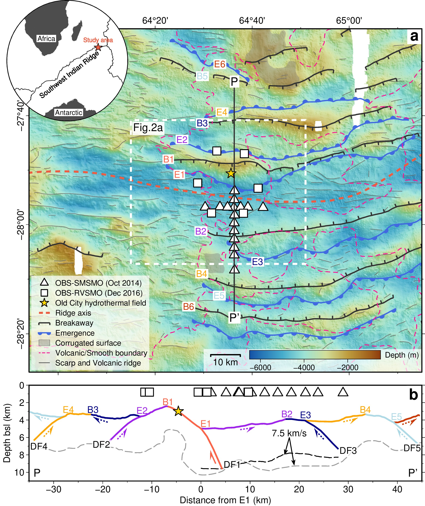

Oceanic detachment faults play a central role in accommodating the plate divergence at slow-ultraslow spreading mid-ocean ridges. Successive flip-flop detachment faults in a nearly-amagmatic region of the ultraslow spreading Southwest Indian Ridge (SWIR) at 64°30’E accommodate ~100% of plate divergence, with mostly ultramafic smooth seafloor. Here we present microseismicity data, recorded by ocean bottom seismometers, showing that the axial brittle lithosphere is on the order of 15 km thick under the nearly-amagmatic smooth seafloor, which is no thicker than under nearby volcanic seafloor or at more magmatic SWIR detachment systems. Our data reveal that microearthquakes with normal focal mechanisms are colocated with seismically-imaged damage zones of the active detachment fault and of antithetic hanging-wall faults. The level of the hanging-wall seismicity is significantly higher than that documented at more magmatic detachments of slow-ultraslow ridges, which may be a unique feature of nearly-amagmatic flip-flop detachment systems.

Download  PDF

在慢速-超慢速扩张洋中脊上，拆离断层在板块扩张中起着重要作用。在超慢速扩张的西南印度洋脊上，64°30'E处的岩浆几乎缺失，板块扩张近全部由翻转的拆离断层完成，形成超基性光滑海床。本文展示了该区域由海底地震仪记录的微地震数据，显示其脆性岩石圈约15km厚，却没有附近的火山型海床或SWIR上其他岩浆供给更多的拆离断层厚。同时，本文的微地震定位及其正断层震源机制解与反射地震呈现的拆离断层及其上盘的反向断层的损伤带一致。与慢速-超慢速扩张洋脊上岩浆更多的拆离断层相比，本研究区的拆离断层上盘的地震活动性明显更高，这可能是岩浆几乎缺失下翻转拆离断层系统的独特性质。

Figure 1: OBS locations and tectonic interpretation of the flip-flop detachment fault system at the eastern SWIR

Figure 2: Distribution of earthquakes and focal mechanisms

Figure 3: Modes of detachment faults and their patterns of seismicity

