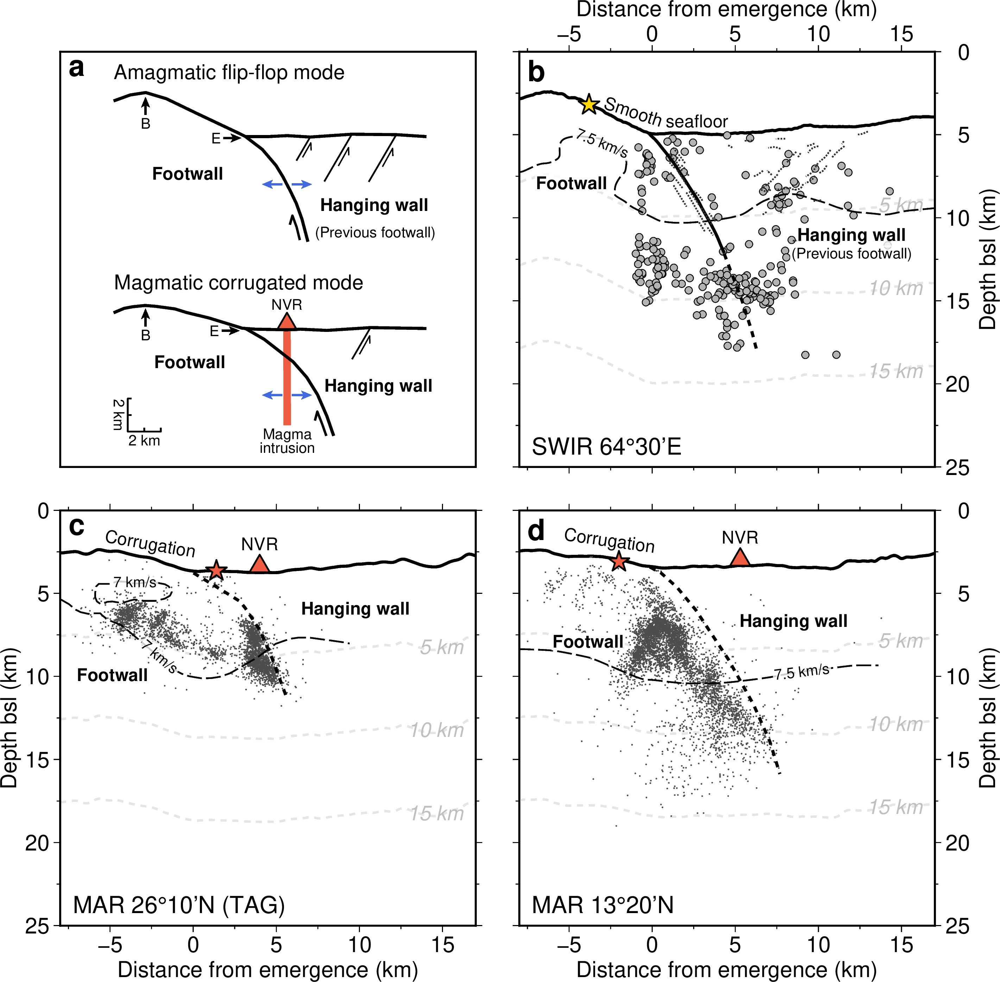

The eastern part of the ultraslow spreading Southwest Indian Ridge (SWIR) has drawn great attention after the identification of a new seafloor spreading mode, called "nearly amagmatic flip-flop detachment faulting". Here we show the results of two different ocean bottom seismometer experiments that collected microseismicity data over the youngest active detachment fault at the SWIR 64°30'E. The seismogenic lithosphere thickness in this nearly zero melt supply spreading context is at least 15 km, no thicker than at a more magmatic SWIR detachment setting (18 km), suggesting that current models of how melt contributes to the thermal regime of slow and ultraslow spreading ridges must be revised. In addition to this, we also show that microearthquakes with normal focal mechanisms are colocated with seismically imaged damage zones of the detachment fault and with conjugate antithetic faults in the hanging wall, documenting the seismogenic activity of the detachment and revealing seismogenic normal faulting in the hanging wall of the detachment, which is not seen at more magmatic detachments at the SWIR or the Mid-Atlantic Ridge. Finally, we domenstrate that there is a link between sparse magmatism in the footwall and seismicity in the detachment, as evidenced by a seismic swarm that we describe. 

Download  PDF

Figure 1: OBS locations and tectonic interpretation of the flip-flop detachment fault system at the eastern SWIR

  

Figure 2: Distribution of earthquakes and focal mechanisms

  

Figure 3: Temporal and spatial distribution of the seismic swarm

 