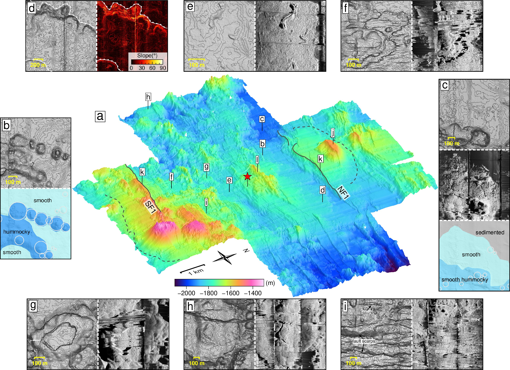

Melt supply at the ultraslow-spreading Southwest Indian Ridge (SWIR) has been shown to vary from nearly-amagmatic, leading to ultramafic seafloor, to magmatically-robust, producing fully volcanic seafloor. The center of the SWIR 50°28'E segment represents a magmatically-robust endmember. High-resolution bathymetry and backscatter, near-bottom magnetic data, and visual observations were acquired to infer spatiotemporal variations in upper-crustal construction over the past 780 kyr. Tectonic strain inferred from observed faults represents <8% of the total plate divergence during this period. Mapped seafloor and lava morphologies show a prevalence of smooth seafloor and smooth hummocky seafloor (64% mapped area), corresponding to a dominance of high-effusion-rate, sheet-lobate lavas, over hummocky seafloor (29%) that mostly comprises low-effusion-rate pillow lavas. This prevalence is most pronounced within a ~5 km-long domain at the segment center, while hummocky seafloor prevails to its east and west, indicating a substantial along-axis decrease in average eruption rate. Across-axis changes of seafloor morphologies and faulting pattern indicate two successive cycles of upper-crustal construction. These cycles last ~300 kyr, interpreted as waxing and waning magmatic phases. During waxing phases, shallow axial melt lenses (AMLs) form beneath the segment center, feeding narrow diking systems that build high-eruption-rate smooth domal volcanos. During waning phases, lower frequencies of melt replenishment may cause the AML to become deeper and ultimately disappear. This configuration triggers diking and hummocky-dominated eruptions over a wider axial domain, with more faults. We propose that modes of upper-crustal construction at slow and ultraslow mid-ocean ridges are influenced by melt supply more than spreading rate.

