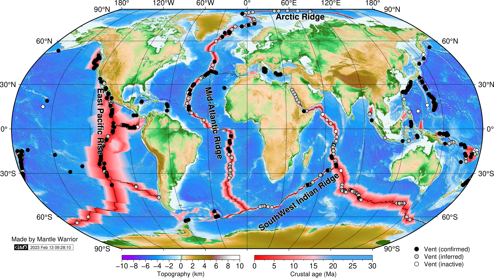

Chen, Jie (2021): Global distribution of hydrothermal vents with respect to spreading rate. figshare. Figure. [https://doi.org/10.6084/m9.figshare.17357678.v2](https://www.researchgate.net/deref/https%3A%2F%2Fdoi.org%2F10.6084%2Fm9.figshare.17357678.v2)

Datasets are from multiple sources: topography (Weatherall et al., 2015), crustal age (Seton et al., 2020), and vent sites ([https://vents-data.interridge.org/](https://www.researchgate.net/deref/https%3A%2F%2Fvents-data.interridge.org%2F)). Figure is made by GMT 6.0 ([https://www.generic-mapping-tools.org/](https://www.researchgate.net/deref/https%3A%2F%2Fwww.generic-mapping-tools.org%2F)).

