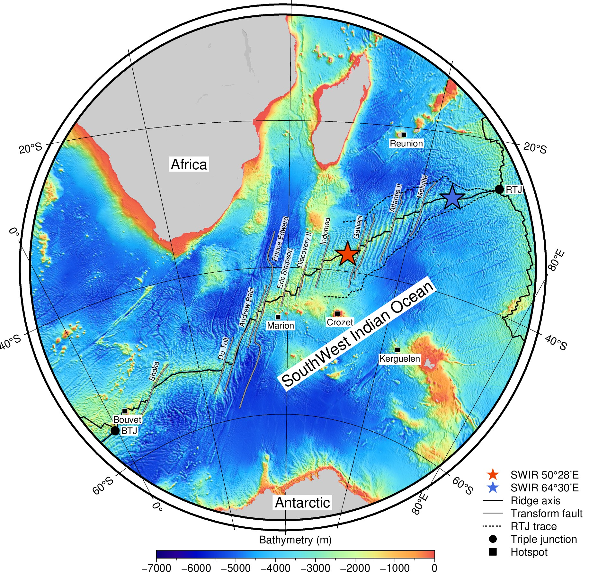

Watch my PhD defense on [YouTube](https://www.youtube.com/watch?v=isdJHUWdoww) or [Bilibili](https://www.bilibili.com/video/BV1rg411P7Z7).

Melt supply at slow spreading ridges has been shown to vary from enough to produce a fully volcanic seafloor, to nearly amagmatic, leading to the widespread exposure of mantle-derived rocks on the seafloor. To better understand the role of melt supply, I study two regions of the ultraslow spreading Southwest Indian Ridge (SWIR) that are endmembers in terms of melt supply: the magmatically-robust SWIR 50°28'E (Part-1 of the thesis) with a 9.5 km-thick crust and a seismic low-velocity anomaly in the lower crust, and a nearly amagmatic corridor at the SWIR 64°30'E (Part-2) with successive flip-flop detachment faults that accommodate almost 100% of plate divergence and continuously exhume mantle-derived rocks. I finally use 2D numerical modelling to relate the thermal regime inferred from these two endmembers to the frequency and depth of melt injections (Part-3). 

In Part-1, I use AUV-based, 2-m resolution bathymetry and backscatter data to map seafloor morphologies and fault distributions and use seafloor photographs to map lava morphologies at the SWIR 50°28'E over the past 780 kyr. The results show evidence of high eruption rates and low tectonic strain, close to what has been observed at intermediate- and fast-spreading ridges. Mapping shows that the modes of upper-crustal construction have varied both in space and time, likely in response to changes in melt supply. Particularly, we propose that the upper crust at this magmatically-robust ridge section was constructed with alternating waxing and waning phases of melt supply over cycles of ~300 kyr. 

In Part-2, I locate microearthquakes over the youngest, active detachment fault at the nearly-amagmatic SWIR 64°30'E, as recorded during two short ocean bottom seismometer deployments. The results suggest a ~15 km-thick seismogenic lithosphere. The earthquake distribution highlights the tectonic activity of the south-dipping detachment fault and of itsconjugate, small, north-dipping faults in the hanging wall. I also document a two-day seismic swarm interpreted as due to an upward-migrating magmatic event in the footwall, triggering a sequence of shallower earthquakes on the detachment fault plane. 

In Part-3, I use numerical modelling to explore the relation between the axial thermal regime and parameters associated with melt flux (the volume and frequency of melt injections) and with the depth of melt emplacement. I successfully predict the thermal regimes at two ultraslow-spreading endmember areas, and I extend these results to the variability of the thermal regime at slow spreading ridges.

