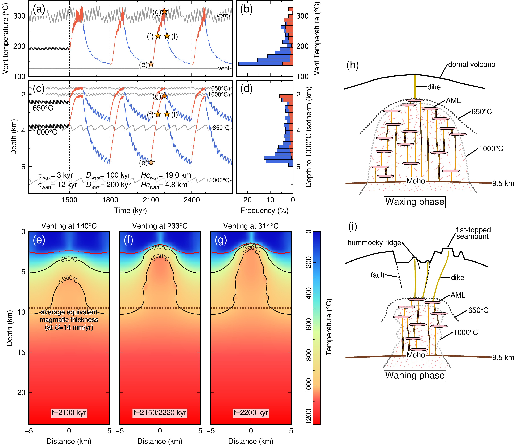

Melt supply at slow-ultraslow spreading ridges is overall reduced and highly variable. Magma cooling and crystallization substantially shape the axial thermal regime by providing heat that is lost to the ocean through conduction and hydrothermal convection. Geological data suggest that melt is emplaced over a wide depth range, variably accessible to hydrothermal cooling, and that periods of higher and lower melt supply may alternate at a given location. Until now, numerical models focused on steady-state thermal regimes controlled by either spreading rate or melt supply, falling short at slow-ultraslow ridges. Here we present results from a 2-D numerical thermal model that couples repeated melt injections and hydrothermal convection. We first constrain thermal regimes inferred from two ultraslow-spreading endmembers in melt supply at the Southwest Indian Ridge (SWIR): a magmatically robust endmember at 50°28'E and a nearly amagmatic endmember at 64°30'E. We adjust parameters associated with melt supply (the melt injection frequency and the temperature of the host rocks upon melt emplacement) and hydrothermal circulation (the extent and permeability of the hydrothermal system). Our simulations predict that greater melt injection frequencies unsurprisingly produce hotter thermal regimes. However, at a given frequency, melt emplacement in cooler host rocks (e.g., <800°C) causes cooler thermal regimes with transient black smoker-type hydrothermal circulation that extracts heat efficiently. Periodic waxing and waning magma supply, as proposed from geological data at the SWIR 50°28'E, induces an oscillatory thermal regime. Transience in the axial thermo-mechanical state may be an integral part of lower-crustal construction at magmatically robust sections of slow-ultraslow ridges.

