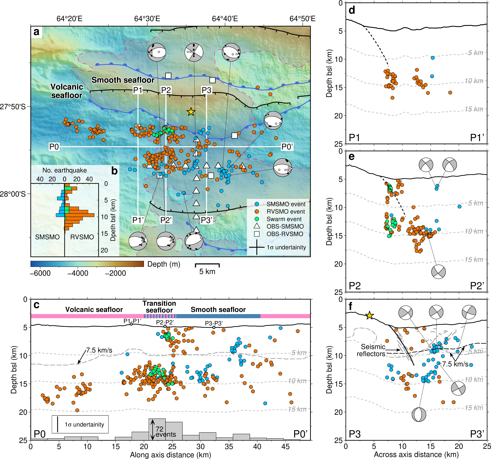

Oceanic detachment faults play a central role in accommodating the plate divergence at slow-ultraslow spreading mid-ocean ridges. Successive flip-flop detachment faults in a nearly-amagmatic region of the ultraslow spreading Southwest Indian Ridge (SWIR) at 64°30’E accommodate ~100% of plate divergence, with mostly ultramafic smooth seafloor. Here we present microseismicity data, recorded by ocean bottom seismometers, showing that the axial brittle lithosphere is on the order of 15 km thick under the nearly-amagmatic smooth seafloor, which is no thicker than under nearby volcanic seafloor or at more magmatic SWIR detachment systems. Our data reveal that microearthquakes with normal focal mechanisms are colocated with seismically-imaged damage zones of the active detachment fault and of antithetic hanging-wall faults. The level of the hanging-wall seismicity is significantly higher than that documented at more magmatic detachments of slow-ultraslow ridges, which may be a unique feature of nearly-amagmatic flip-flop detachment systems.

