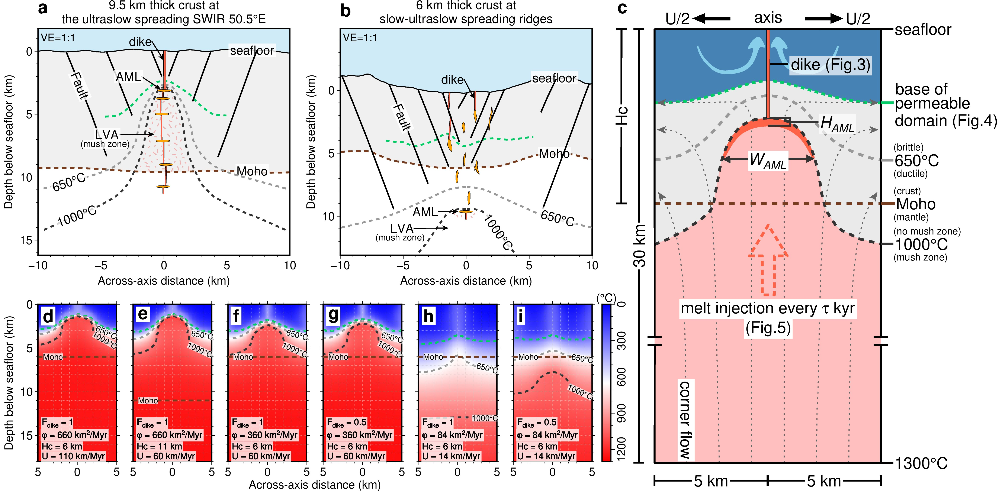

The thermal state of mid-ocean ridges exerts a crucial modulation on seafloor spreading processes that shape ~2/3 of our planet's surface. Standard thermal models treat the ridge axis as a steady-state boundary layer between the hydrosphere and asthenosphere, whose thermal structure primarily reflects the local spreading rate. This framework explains the deepening of axial melt lenses (AMLs)—a proxy for the basaltic solidus isotherm—from ~1 to ~3 km from fast- to intermediate-spreading ridges but fails to account for shallow crustal AMLs documented at slow-ultraslow spreading ridges. Here, we show that these can be explained by a numerical model that decouples the potentially transient ridge magma supply from spreading rate, captures the essential physics of hydrothermal convection, and considers multiple modes of melt emplacement. Our simulations show that melt flux is a better thermal predictor than spreading rate. While multiple combinations of melt/dike emplacement modes, permeability structure, and temporal fluctuations of melt supply can explain shallow crustal AMLs at slow-ultraslow ridges, they all require elevated melt fluxes compared to most ridge sections of comparable spreading rates. This highlights the importance of along-axis melt focusing at slow-ultraslow ridges and sheds light on the natural variability of their thermal regimes.

