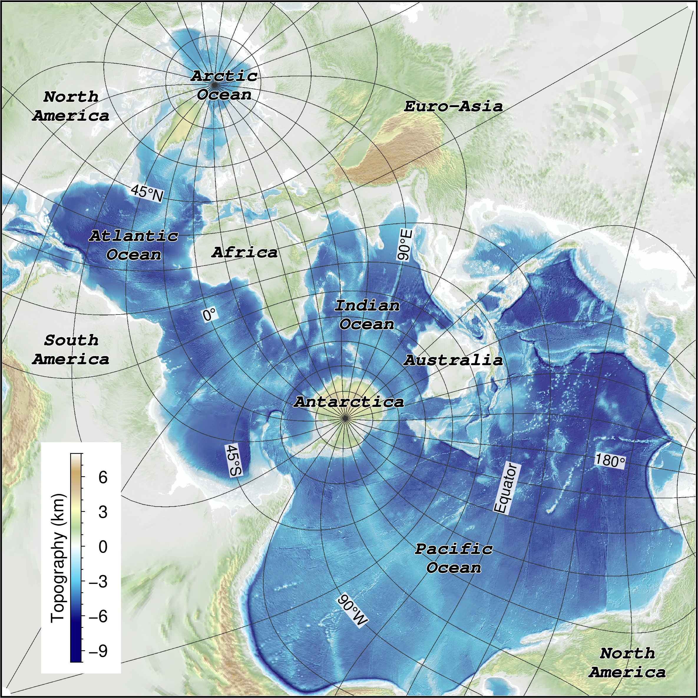

Watch the video introduction for this paper on [YouTube](https://youtu.be/Xv-rxroPnJQ) or [Bilibili](https://www.bilibili.com/video/BV1az4y1H7TL/?vd_source=005d718b4507dd65726bd062e0c9bfcb).

The ocean, as a vast interconnected body of water on Earth, plays an essential role in Earth’s planetary dynamics, climate change, and the evolution of human society and decision-making processes. An ocean-focused global map is necessary to visually capture numerous phenomena within the world’s ocean and seafloor. Here we present the power of the Spilhaus square projection with various geological and geophysical datasets, including bathymetry, teleseismicity, seafloor geography, and seafloor spreading parameters. The Spilhaus projection, compared to widely-used map projections (e.g., Mercator and Robinson), emphasizes the seamless connection of water masses surrounded by continents. This projection has recently garnered attention for presenting ocean-oriented data, although it is not extensively used and currently supported by the ArcGIS software. Maps presented here provide not only a novel geological perspective on the world ocean as a whole body, but also new insights/questions to be addressed regarding features and processes of the water body, the seafloor, and ocean-atmosphere dynamics, which can be used for research, education, media, and policy decisions, and promote similar approaches.

