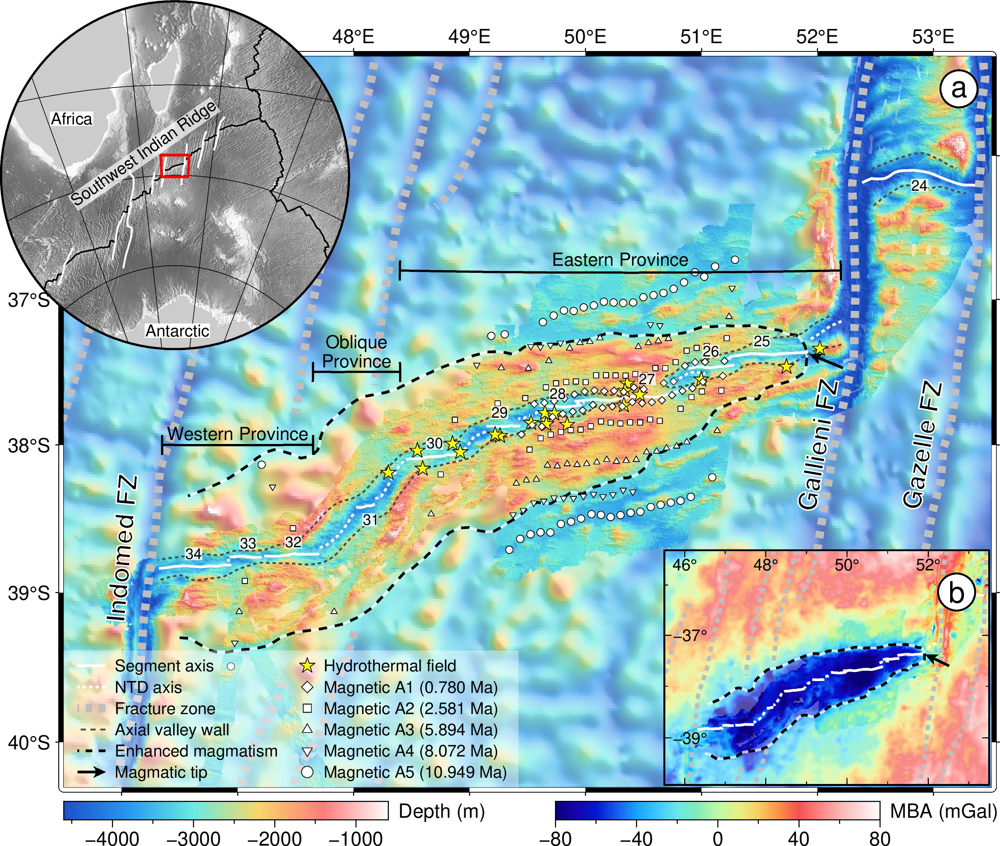

The Indomed-Gallieni supersegment (46-52°E) of the Southwest Indian Ridge (SWIR) has been of interest as a melt-rich endmember of ultraslow spreading mid-ocean ridges, attributed to enhanced magmatism since 11 Ma. This provides an excellent opportunity to study the evolution and the impact of enhanced magmatism at mid-ocean ridges. Here we combine shipboard bathymetry and gravity data over the SWIR 46-53.5°E. We illustrate that the enhanced magmatism initiated in the western part of the Indomed-Gallieni supersegment with decreasing crustal productions and no propagation. In the eastern part, the enhanced magmatism propagated to the east at decreasing propagating velocities, producing an increasingly thick crust. The present propagation tip is at 51.9°E, ∼30 km to the west of the Gallieni transform fault (TF). The most magmatically-robust area of the propagation has been located near 50.5°E since ∼6 Ma. We hypothesize that a mantle melting anomaly with heterogenous upwelling rates and/or geometry was responsible for the change of the enhanced magmatism. The enhanced magmatism plays significant roles in ridge segmentation and seafloor spreading modes. The degree of along-axis melt focusing was lowered, causing the segmentation to be typical of slow spreading ridges. As magmatism dramatically decreases over 160 km along the ridge axis from the most robust (producing a 9.5-km-thick crust at 50.5°E) to nearly-amagmatic near the Gallieni TF, this ridge section exhibits the full spectrum of ultraslow spreading modes, changing from magmatically-controlled (intense volcanism and almost no faulting) to tectonically-dominated (smooth ridges and extensive peridotites outcrops) modes.

