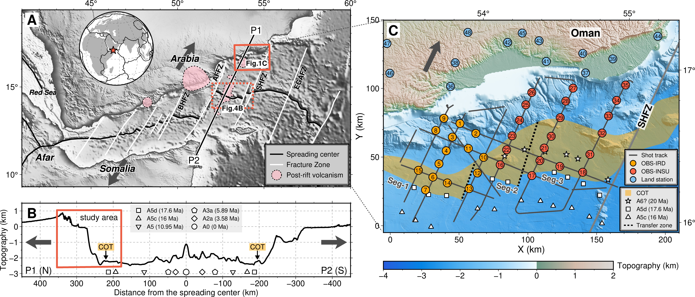
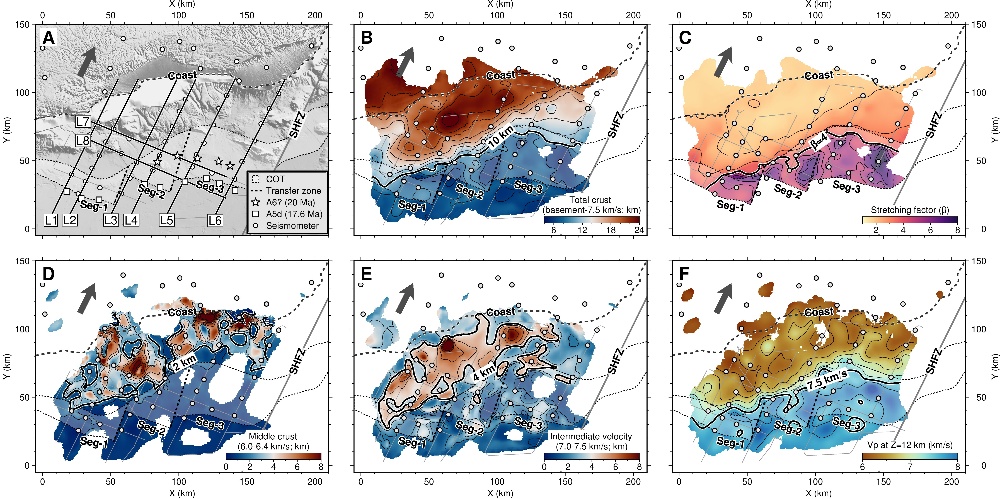
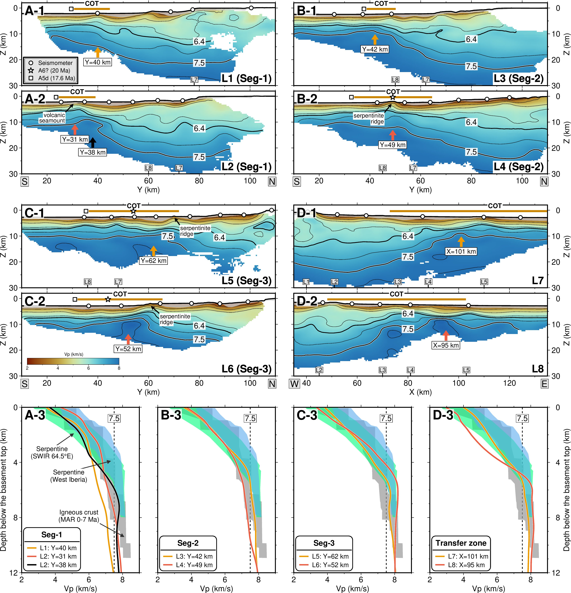
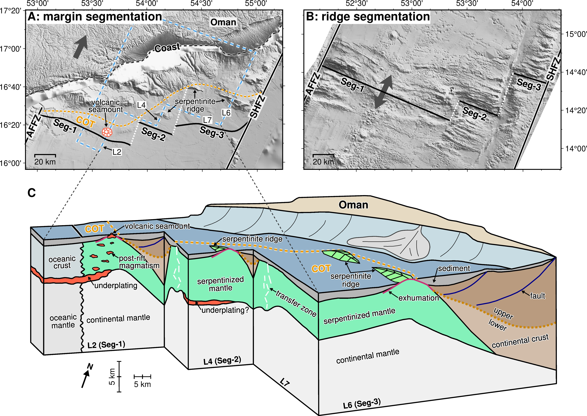

Plain Language Summary This study explores how continents break apart, focusing on the north‐eastern Gulf of Aden, where the continental crust stretched and thinned to form a new ocean. Using 3‐D seismic data, we examined changes in crustal thickness and structure during this process. We found a 45° angle (obliquity) between directions of crustal thinning and extension, a feature that significantly impacts the pattern of seafloor spreading as the ocean grows. In the region known as the Continent‐Ocean Transition (COT), the crust progressively thins from 13 to 5 km toward the east. By combining these observations with earlier studies of magnetism and heat flow, we identified two distinct stages of crustal thinning. First, the mantle rock beneath the crust is exposed through faulting, especially in the east. Later, volcanic activity in the west adds new material onto the stretched mantle. This study shows how different processes, both during and after continental breakup, shape the crust, improving our understanding of this fundamental global tectonic process.

