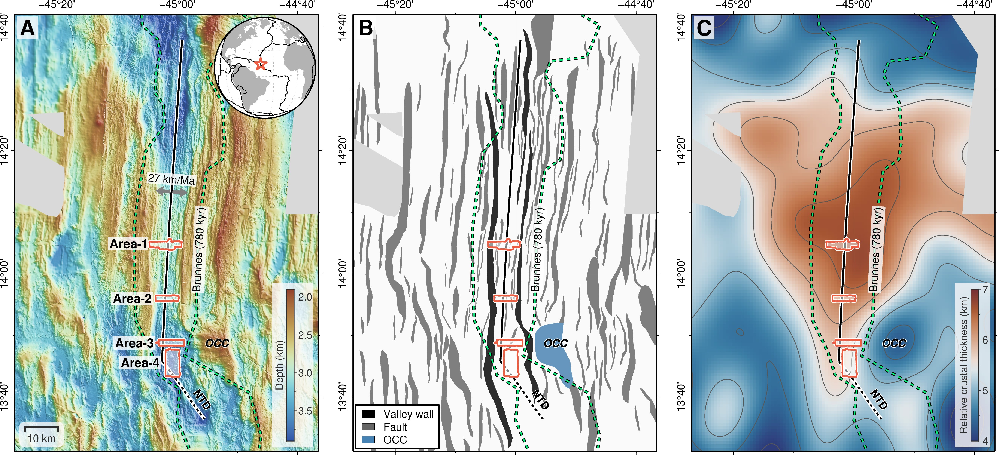
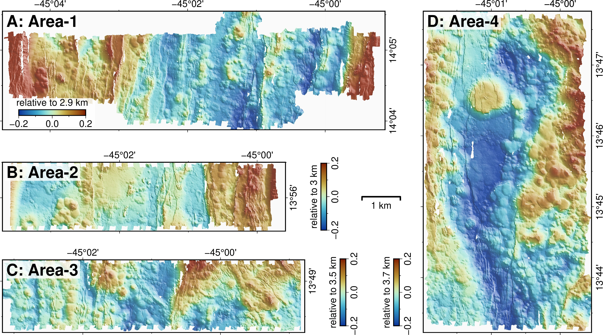
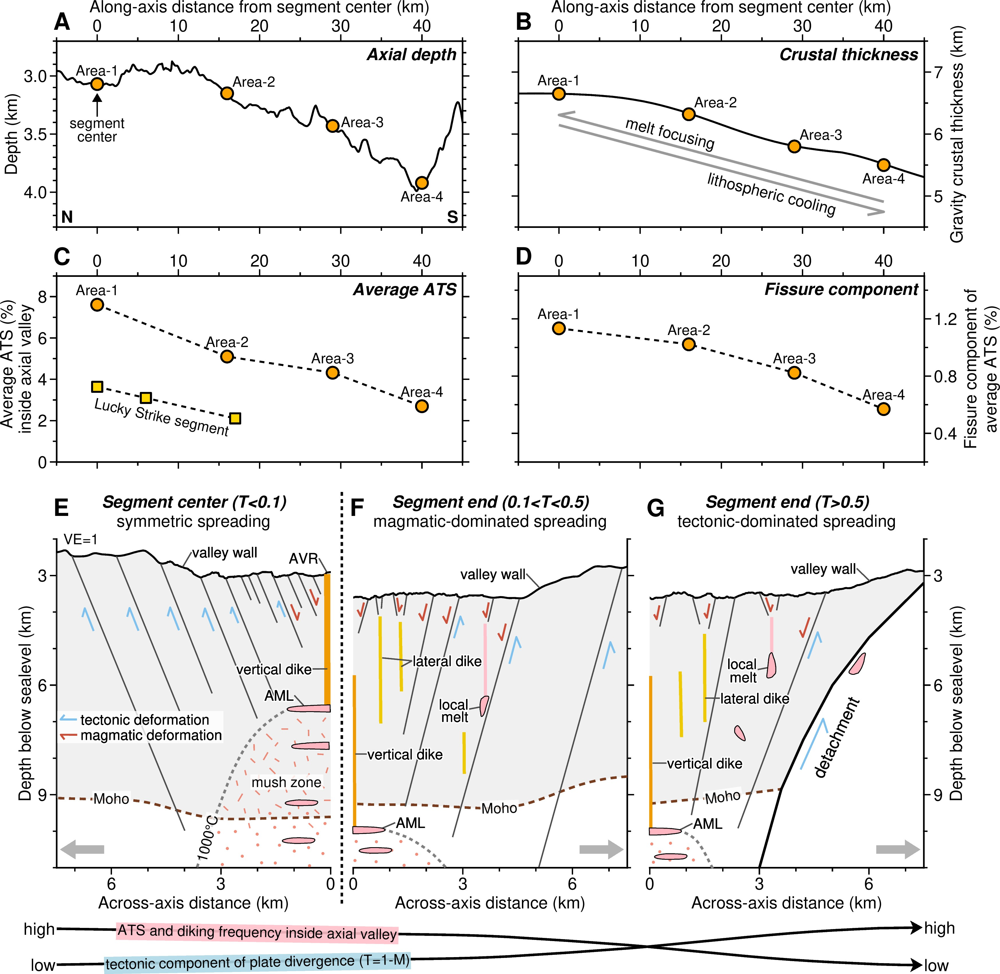
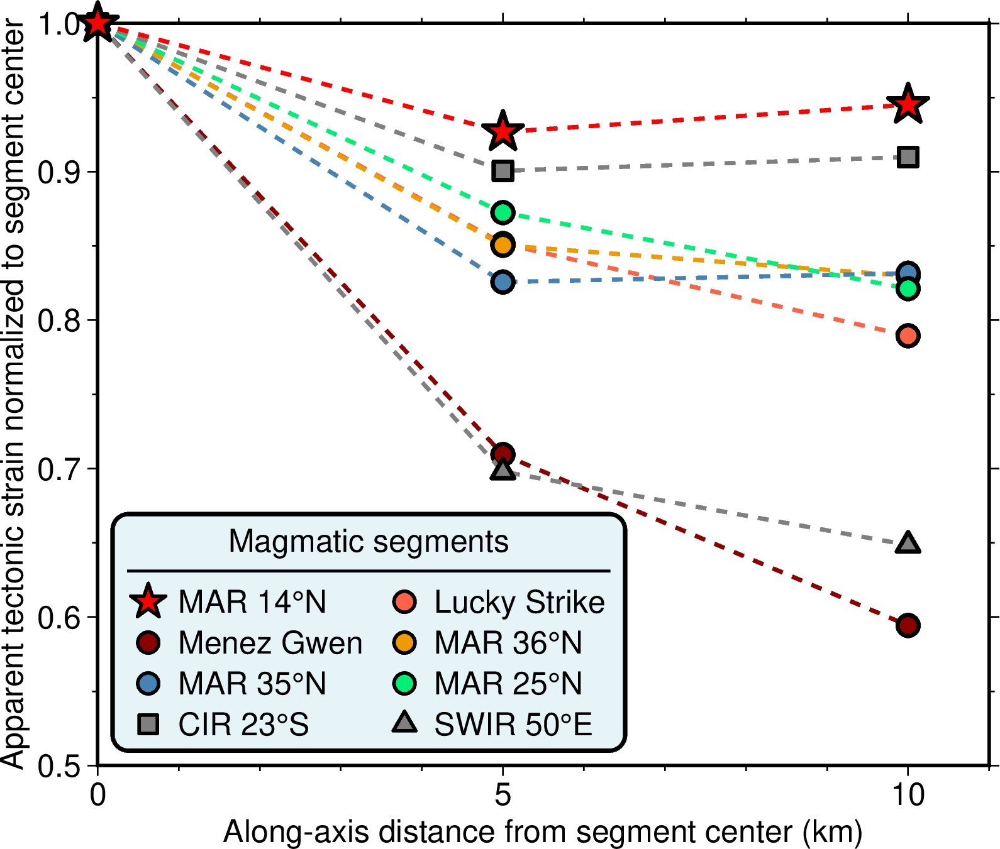

Slow-spreading ridges are highly segmented divergent plate boundaries with various modes of magma supply and faulting. Conventionally, magmatism and faulting that accommodate the plate divergence are thought to have an inverse relationship. However, our observations on fine-scale faulting, using high-resolution Autonomous Underwater Vehicle (AUV) bathymetry data along the axial-valley floor of the 14°N segment of the Mid-Atlantic Ridge, challenge this hypothesis. We show that axial faulting decreases from the segment center to the segment end as the rate of magma supply decreases and the lithosphere cools. This general pattern is also observed on several other slow-spreading ridge segments. We propose that this pattern relates to the link between fine-scale, newly-created axial faults and fissures and modes of magma supply. At segment centers, diking is frequent and centralized to the ridge axis, yielding strain localization and creating closely-spaced faults, whereas at segment ends, diking is less frequent and more widely distributed, yielding strain delocalization with faults distributed throughout the axial valley floor.

